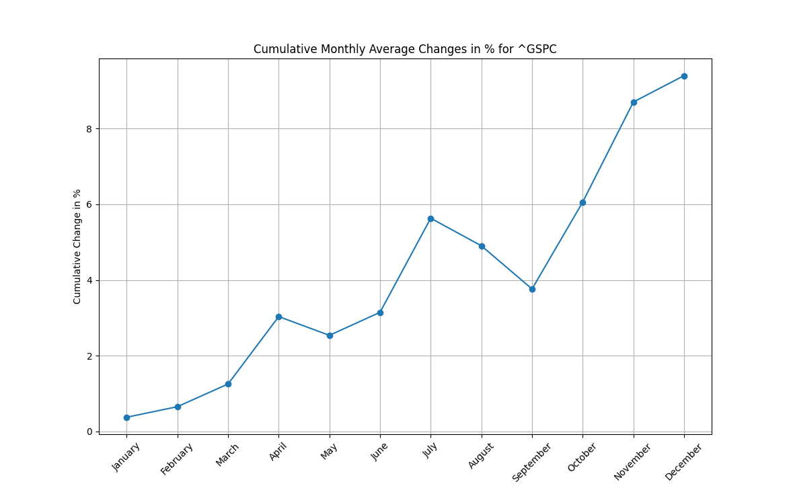
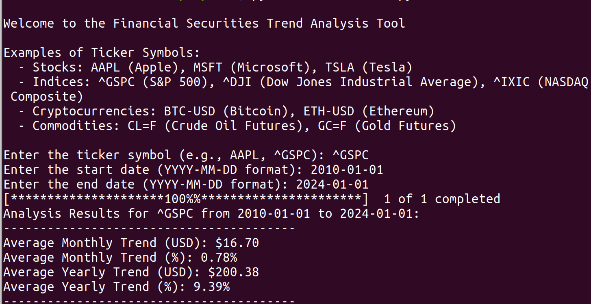
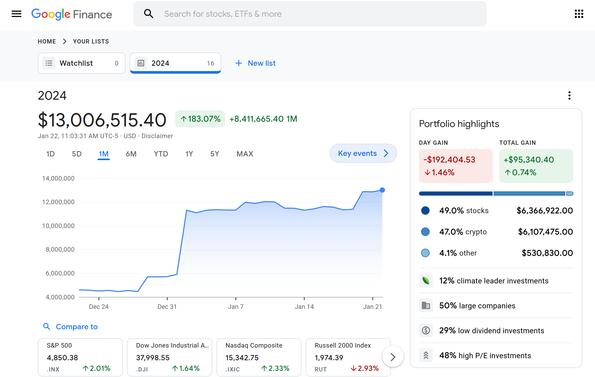

# Financial Securities Trend Analysis Tool

## Introduction
This Python script offers a comprehensive analysis of financial securities, encompassing stocks, indices, cryptocurrencies, and commodities. Leveraging historical data from Yahoo Finance, it calculates and visualizes monthly and yearly trends in both USD and percentage terms.

## Purpose of the Trend Analysis Tool

### In-Depth Financial Insights
The motivation behind developing this tool was to enable a deeper understanding of investment trends across various financial instruments. Recognizing the annual returns of major indices like the S&P 500, DOW, and NASDAQ is just the beginning. This tool goes further by illustrating these trends visually, providing a clear picture of monthly fluctuations and annual performance expectations.

### Versatile Investment Analysis
Investors often encounter diverse trends when comparing commodities like Crude Oil and Gold or contrasting these with stock indices. This tool demystifies such variations, especially useful for strategizing short-term investments or intraday trading decisions.

### Trend Consistency and Seasonality
Understanding the consistency of trends and their seasonality is crucial for making informed investment choices. This tool offers the ability to visualize how specific financial securities behave over time, which is invaluable for anticipating monthly behaviors and gauging the stability of yearly returns

In essence, the Trend Analysis Tool is designed to provide clarity and actionable insights, helping users to navigate the complexities of financial markets with confidence.

### Example of the Program Output

### Example of Results Using This Program
This is a screeentshot of a live investment portfolio that was created using this programs analysis as well as some other tools I have published.

### Streamlined Financial Analysis
Our script simplifies the complex world of financial data analysis. With just a few clicks, users can access detailed trends of stocks, indices, cryptocurrencies, and commodities over a specified time period. This tool brings powerful financial insights right to your fingertips.

### Time-Saving and Accessible
Gone are the days of manually sifting through extensive financial data. This script saves time by automating data fetching and analysis. It's designed with both beginners and experienced traders in mind, making financial data analysis more accessible to everyone.

### Customizable and Expandable
The script is not only easy to use but also highly customizable. Users can analyze any security available on Yahoo Finance, and developers can easily expand its capabilities to include more features, such as additional data points, different analysis methods, or integration with other financial tools.

### Visual and Quantitative Insights
By providing both graphical and quantitative analysis, the script caters to various preferences. Whether you're a visual learner who likes to see trends in a plot or someone who prefers hard numbers, this tool has got you covered.

### Educational Value
For those learning about the stock market, trading, or financial analysis, this script serves as an excellent educational tool. It provides practical experience in analyzing market trends and understanding the dynamics of different financial instruments.

By utilizing this script, users can make more informed decisions, explore financial markets, and develop a deeper understanding of the world of finance.

## Installation
Ensure Python and necessary dependencies are installed on your system. Follow these steps to set up:

1. **Clone the Repository:**
   git clone https://github.com/cgfoxtrot/Financial-Securities-Trend-Analysis.git

2. **Navigate to the Directory:**
   cd Financial-Securities-Trend-Analysis

3. **Install Required Packages:**
   pip install -r requirements.txt

## Requirements
- Python 3.8 or later
- yfinance
- pandas
- matplotlib
- numpy

Dependencies are specified in `requirements.txt` for convenience.

## Usage
Execute the script via command line and input the ticker symbol and date range as prompted:

python script.py

### Example Ticker Symbols
- **Stocks:** AAPL (Apple), MSFT (Microsoft), TSLA (Tesla)
- **Indices:** ^GSPC (S&P 500), ^DJI (Dow Jones Industrial Average), ^IXIC (NASDAQ Composite)
- **Cryptocurrencies:** BTC-USD (Bitcoin), ETH-USD (Ethereum)
- **Commodities:** CL=F (Crude Oil Futures), GC=F (Gold Futures)

## Contributing
Your contributions are welcome. Fork the repository, make your changes, and initiate a pull request.

## License
This project is open source, distributed under the [MIT License](LICENSE).
